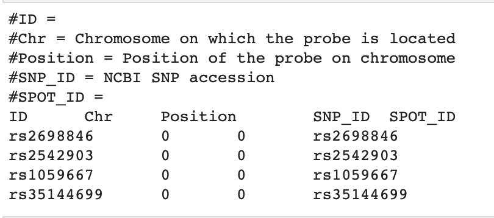

# GWAS Case Study-Data Preparation
```{r setup, include=FALSE}
knitr::opts_chunk$set(echo = TRUE)
knitr::opts_knit$set(root.dir = "./Data/case_data")
getwd
```

Here we introduce a hands-on practice of a case study on genome-wide association study with **continuous traits**. This breast cancer study of Polish Caucasion cohort aims to identify new CYP2D6 DNA variants associated with impaired metabolism of tamoxifen toward endoxifen, and can be used to predicting efficacy of tamoxifen treatment. In this chapter, we will use their preprocessed **192 DNA samples** selected from the Polish Caucasian cohort to show you a typical GWAS workflow. The selection of these 192 samples is based on ratio of the sum of two tamoxifen active metabolite ((Z)-endoxifen and (Z)-4-OH-Tam) plasma concentrations to the sum of the concentrations of tamoxifen and the remaining measured compounds. As a result, 96 samples were from patients with the highest ratio, and 96 were from those with the lowest ratio. Please refer to the following paper if you are interested in details of this data.

**Reference paper:** Hennig EE, Piatkowska M, Goryca K, Pospiech E, Paziewska A, Karczmarski J, Kluska A, Brewczynska E, Ostrowski J "[Non-CYP2D6 variants selected by GWAS improved the prediction of impaired tamoxifen metabolism in breast cancer patients](https://www.ncbi.nlm.nih.gov/pmc/articles/PMC6722498/)." J Clin Med. 2019 Aug; 8(8): 1087. doi: 10.3390/jcm8081087

> <span style="color: red;"> **Important:** Raw Whole Genome Sequencing data can be very large, more than 1Gb. We will show you the codes about how to download and preprocess the raw genotype data from start. But to run the analysis on laptop with limited memory, we provide the subsetted genotype data with only the first 1000 SNPs for you to practice. </span>

## Environment setting and packages

Before we can run any analysis, we need to set the working path in both R and bash and install the necessary R packages. To setup the working directory, make sure you run the following codes in R.

```{bash eval=F}
# change the path below to where you saved "cshl_gwas" folder
## run in R Terminal
mydir="/path/to/cshl_gwas/Data/case_data"
cd $mydir
```

```{r eval=F}
# R codes- run in R Console
setwd("/path/to/cshl_gwas/Data/case_data")
mydir<-getwd()
```

The packages we will use in this chapter include: data.table, GEOquery (from Biocondector), GenABEL, qqman, png and QCGWAS. You will need to install these packages by yourself in R. The codes to install these packages are list below and are commented out with `#`.

```{r}
# R codes- run in R Console
#install.packages("data.table")
#install.packages("qqman")
#install.packages("png")
#install.packages("QCGWAS")

#if (!require("BiocManager", quietly = TRUE))
#    install.packages("BiocManager")

#BiocManager::install("GEOquery")

```

After installation, the list of packages are loaded with `library()` function.

**The following code might generate multiple message when loading the packages, such as "The following objects are masked from XXX", which is normal. You can ignore them.**

```{r eval=T, results='hide',warning=F,error=F,message=F}
# R codes- run in R Console
#load R packages
library(data.table)
library(GEOquery)
library(qqman)
library(png)
library(QCGWAS)
```

## Accessing data

### Data availability

> <span style="color: red;"> Important: Genotype data is too large to be uploaded to GitHub so you can't run codes in this section directly without the data. You can follow the codes below to try download them on your own computer if you have enough storage. We will just load from our downloaded data here. </span>

The data for the study **GSE129162** can be downloaded from NCBI data warehouse website. The link is https://www.ncbi.nlm.nih.gov/geo/query/acc.cgi?acc=GSE129162

The following code can download the pheonotype and genotype data.

**Phenotype data:**  
**GSE129162_series_matrix.txt.gz** can be downloaded using [this link](https://ftp.ncbi.nlm.nih.gov/geo/series/GSE129nnn/GSE129162/matrix/). You can also download by running the following bash code if you have the exact url of the download files.`wget` command is followed by the files address, meaning that we want to download the data located in this address. Then we will unzip the file using `gunzip` command.

**The codes here are commented out, as we already have this file downloaded for you. We will read in the data from the central folder.** (If you want to try them, you can remove the `#` before `system()` command.The this data will be downloaded again.)

```{bash}
# bash codes- run in terminal
# data_path=/path/to/cshl_gwas/Data/case_data
# wget ftp://ftp.ncbi.nlm.nih.gov/geo/series/GSE129nnn/GSE129162/matrix/GSE129162_series_matrix.txt.gz -P $data_path
# gunzip $data_path/*gz #this code replaces the .gz file with an uncompressed file
```

The platform data **GPL16104-1240.txt** is used for genotype annotation and can be downloaded from link https://www.ncbi.nlm.nih.gov/geo/query/acc.cgi?acc=GPL16104.

**Genotype data:**  
**GSE129162_Plate_1_Full_Data_Table.txt.gz**(96 samples) is downloaded from [this link](https://ftp.ncbi.nlm.nih.gov/geo/series/GSE129nnn/GSE129162/suppl/GSE129162%5FPlate%5F1%5FFull%5FData%5FTable%2Etxt%2Egz)  
**GSE129162_Plate_2_Full_Data_Table.txt.gz**(96 samples) is downloaded from [this link](https://ftp.ncbi.nlm.nih.gov/geo/series/GSE129nnn/GSE129162/suppl/GSE129162%5FPlate%5F2%5FFull%5FData%5FTable%2Etxt%2Egz)

**You don't need to download these genotype data files to your account. They are extremely large and will take long time to finish. We have already downloaded them for you.**

The following code is what we used to download and unzip the genotype data. You can try practice `wget` command using some small data on your own computer.

```{bash}
# bash codes- run in terminal
# data_path=/path/to/cshl_gwas/Data/case_data
# wget https://ftp.ncbi.nlm.nih.gov/geo/series/GSE129nnn/GSE129162/suppl/GSE129162%5FPlate%5F1%5FFull%5FData%5FTable%2Etxt%2Egz -P $data_path
# wget https://ftp.ncbi.nlm.nih.gov/geo/series/GSE129nnn/GSE129162/suppl/GSE129162%5FPlate%5F2%5FFull%5FData%5FTable%2Etxt%2Egz -P $data_path
# gunzip $data_path/*gz
```

### Data files documentation

Below is a brief summary of the data information we need and their location in file. You can view the phenotype data by directly opening the file in `data` folder. But the platform and genotype data is too large to load here (genotype data is 8.2GB each, and platform data is 85.2MB). They are saved at our central folder to save space, and we will read these data from there when we start analysis.

* **GSE129162_series_matrix.txt** (phenotype data)
  + Each column represents one sample. The first 96 samples match the genotype data in Plate 1, and the last 96 samples are on Plate 2. 
  + Row 42 is sample ID, eg. "3TX", "23TX", "41TX" 
  + Row 53-66 are phenotype data on 14 different metabolites 
  + Row 66 is z-endoxifen ratio(or metabolite ratio (MR)), which we'll use in our analysis 
  + This data don't have covariates information
  

* **GPL16104-1240.txt** (SNP information)
  + Row 6 is the start of SNP information
  + Col 1 is SNP ID
  + Col 2 is chromosome
  + Col 3 is physical position 
  + Col 4 is NCBI SNP accession
  
  
* **GSE129162_Plate_1_Full_Data_Table.txt**   
  **GSE129162_Plate_2_Full_Data_Table.txt**  
  (genotype, saved at our central folder "/anvil/projects/x-tra220018/2023/datasets/GWAS_data/" because of the large size.)
  + Row 1 is header, this genotype data contains much more information that we need. We'll clean it first in '5. Prepare PLINK data'
  + Col 1 is SNP ID
  + Statistical quality control procedures were already performed by original paper


* **sampleID.txt** (Sample ID)
  + Note: sample ID of genotype data and phenotype data are in the same order

You can open the phenotype data to check the file format directly, but the genotype data will be too large to upload to GitHub. You can download to your laptop if there's enough storage.

We have subsetted only 1000 SNPs from the raw genotype data. The subsetted data are saved as `GSE129162_1k_geno1.txt` and `GSE129162_1k_geno2.txt`. We will directly use these subsetted data for following analysis.

Let's first use `head` to print only the first several lines of the data and show you the file format.

```{bash}
# bash codes- run in terminal
#platform
# head GPL16104-1240.txt
```
 

```{bash}
# bash codes- run in terminal
# genotype
head -n 5 GSE129162_1k_geno1.txt
```
```{bash}
# bash codes- run in terminal
head sampleID.txt
```

## Preprocessing Phenotype Data

### Extracting phenotype data

There are 14 metabolites phenotype data, but we won't analyze all of them. Also, as there are many useless information in the original phenotype file, we need to extract only the information we use for analysis.
  + Obtain only sample ID and phenotype data from **GSE129162_series_matrix.txt**  
    ==> save data as **phenotype.txt**: Col 1 is sample ID, Col 2 is trait 1, Col 3 is trait 2, Col 4 is trait 3

We will use the `getGEO` function from `GEOquery` package to read in this data. `GEOquery`is a very useful tool to handle GEO accession data like this. A detailed documentation of `GEOquery` package can be found [here](https://www.bioconductor.org/packages/release/bioc/manuals/GEOquery/man/GEOquery.pdf). `getGPL=FALSE` arguement means that we won't include the GPL information in this matrix.

You might see a message of "Use `spec()` for the full column specification" message when running the code below. This is a normal message from the function telling you that it parsed the characteristic information for you. Please don't worry about this.

```{r}
# R codes- run in R Console
my_gse <-"GSE129162"
my_pheno <- getGEO(GEO=my_gse, filename="GSE129162_series_matrix.txt", getGPL=FALSE)
```

`ls` lists the current objects we have loaded, and we will see `my_pheno` is already there.

```{r}
# R codes- run in R Console
ls()
```

The codes below show that `my_pheno` is an **ExpressionSet** object which can be manipulated easily in R. We also print a brief summary of `my_pheno`, which shows that we have 192 samples.

```{r}
# R codes- run in R Console
class(my_pheno)
show(my_pheno)
```

Data stored in `my_pheno` can be extracted using `pData`. Here we will print the first 6 rows to take a look.

```{r}
# R codes- run in R Console
head(pData(my_pheno))
```

As you can see, the table size is too large and contain too many useless information. `colnames` function can help us to check what information is contained in this data table by printing all the column names.

```{r}
# R codes- run in R Console
colnames(pData(my_pheno))
```

Here, we will only extract the sample ID and all 14 metabolites data from the large table. `pheno_var` lists all the column names of the data we will extract, and these extracted data will be saved in object `phenotype`. We will still print the first 6 rows as a preview. You can see that the table becomes much smaller and only contains the data we will use.

```{r}
# R codes- run in R Console
pheno_var<- c('title','(e)-a-oh-tam:ch1','(e)-endoxifen:ch1',
              '(z)-4-oh-tam + 3-oh-tam:ch1','(z)-a-oh-tam:ch1',
              '(z)-endoxifen + 3-oh-ndm-tam:ch1','4-oh-ndm-tam-gluc:ch1',
              '4-oh-tam-o-gluc:ch1','4prim-oh-ndm-tam:ch1','4prim-oh-tam:ch1',
              'ndm-tam:ch1','tam-n-gluc:ch1','tam-n-oxide:ch1','tamoxifen:ch1',
              'z-endoxifen ratio:ch1')
phenotype <- pData(my_pheno)[,pheno_var]
head(phenotype)
```

You can also explore other columns using `$` and `head`. You can play with this code by changing it to different columns.

```{r}
# R codes- run in R Console
# explore each one
head(pData(my_pheno)$characteristics_ch1.3)
```

We also need to check the variables class to make sure they are read in correctly.

```{r}
# R codes- run in R Console
apply(phenotype,2,class)
```

From the table of `phenotype` above, we can see that the class of characters are not recognized correctly. All the metabolites data are recognized as `character` while they should be `numeric`. Therefore, we need to change the types of these varaibles into the correct class before we can do further exploration.

In the code below, we use `as.character` to change the first column `title` to a character. The second row applys `as.numeric` to each of the metabolites variables with `apply`, then combine them again with the first column using `cbind` (column binding). The second argument `"2"` in the `apply` function indicates that we will apply the `as.numeric` to each **column** ("2" indicates column, and "1" indicates row). Finally, we rename the columns with simpler names and save it as **phenotype.txt**.

**The codes below will generate a list of warning message saying that “NAs introduced by coercion”. This is because our phenotype data contains missing values. You don't have to worry of this as we will impute this missings in next section.**

```{r warning=F,message=F,error=F}
# R codes- run in R Console
#change to numeric, warning because of NA
phenotype <- cbind(phenotype[,1], apply(phenotype[,2:15],2,as.numeric))
# rename into shorter names, column names don't like special characters and don't like numbers as start
colnames(phenotype) <- c('sample_ID','e.a.oh.tam','e.endoxifen',
                         'z.4.oh.tam_3.oh.tam','z.a.oh.tam','z.endoxifen_3.oh.ndm.tam',
                         'V4.oh.ndm.tam.gluc','V4.oh.tam.o.gluc','V4prim.oh.ndm.tam',
                         'V4prim.oh.tam','ndm.tam','tam.n.gluc','tam.n.oxide',
                         'tamoxifen','z.endoxifen_ratio')
#save
write.table(phenotype,"phenotype.txt", 
            sep="\t", quote=F, row.name=F,col.names=T)
```

### Summary of Phenotypes Data

* Phenotype data: 
    + **phenotype.txt** #Col 1 is sample ID, Col 2-15 are metabolites data.
    
As we said in the last step, there are missing values in the phenotype data. We also need to check the distribution of this phenotype data to see if other preprossessing steps such as normalization is needed.

```{r}
# R codes- run in R Console
# Read data
phenotype=fread("phenotype.txt", header=T)
head(phenotype)
```

This phenotype data still has too many metabolites. We will only select several metabolites that are of interest, and use them to perform the future analysis. In the reference paper, they mentioned 2 tamoxifen active metabolites ((Z)-endoxifen and (Z)-4-OH-TAM) and also a metabolite ratio statistic (MR) which corresponds to the (Z)-endoxifen efficacy threshold level. We will mainly focus on using these 3 variables as phenotype data. The MR variable refers to the last column `z.endoxifen_ratio` in the phenotype data.

The codes below first select these specific variables from phenotype data, and save them as a new object `pheno_mr`, then rename them with even shorter abbreviations for easy handling. This `pheno_mr` is saved as **pheno_mr.txt**, and the first column of sample ID is saved as **sampleID.txt**.

```{r}
# R codes- run in R Console
#only select necessary pheno
pheno_mr <- phenotype[,c('sample_ID','z.4.oh.tam_3.oh.tam','tamoxifen','z.endoxifen_ratio')]
names(pheno_mr) <- c("id","z4", "tam","mr")
head(pheno_mr)
```

```{r}
# R codes- run in R Console
fwrite(pheno_mr, "pheno_mr.txt", sep="\t",quote=F,row.name=F, col.name=T,na="NA")
fwrite(pheno_mr[,"id"],"sampleID.txt",sep="\t",quote=F,row.name=F, col.name=T,na="NA")
```

### Histogram of each trait
In this section, we will discover the distribution of these 3 traits using histogram. As there are missing values in the data, written as 'NA', we need to exclude them with !is.na when generating the histogram. The plots are generated for each of the 3 variables with hist function, xlab argument specifies the x-axis label and main specifies the plot title.

```{r hist}
# R codes- run in R Console
hist(pheno_mr$z4[!is.na(pheno_mr$z4)],xlab="Z-4-oh-Tam",main="histogram of Z-4-oh-Tam")
hist(pheno_mr$tam[!is.na(pheno_mr$tam)],xlab="tamoxifen",main="histogram of tamoxifen")
hist(pheno_mr$mr[!is.na(pheno_mr$mr)],xlab="z-endoxifen ratio",main="histogram of z-endoxifen ratio")
```

From the above histograms, we can see that the distribution of these 3 traits are all above zero and slightly skewed. This could violate the normality assumption as current phenotype values are all positive. We might want to perform normalization before analysis.

### Handling the missing values in the phenotypes and covariates

Remember that we still have missing values in our phenotype data, we need to impute these NAs as well. The following code imputes the missing values in the phenotype with the mean of the variable.

In the following codes, we first exclude the first variable, "sample ID", from `pheno_mr` and save only the phenotypes as `pheno0`. Then we write a `for loop` that replaces missing values(NA) in each trait with mean of non-missing values. The imputed phenotype data is saved as `phenotype0.txt`.

```{r}
# R codes- run in R Console
pheno_mr <- read.table("pheno_mr.txt",header=T)
pheno0=pheno_mr[,-1] #remove sample ID (Col 1)
n=dim(pheno0)[1] #sample size
p=dim(pheno0)[2] #number of traits
for (i in 1:p){
  pheno0[is.na(pheno0[,i]),i]=mean(pheno0[!is.na(pheno0[,i]),i]) #for each trait, replace missing values with the mean of the variable
}
head(pheno0)
```

### Checking normality assumptions for each trait
The association test is essentially a linear regression for continous reponse variable. Thus, it is worthwhile to check whether the normality assumption is valid for the responses. The **Shapiro-Wilk test** is one of the popular normality test. The following code conduct the Shapiro tests on the three response variables. When the P-value of Shapiro test is greater then 0.05, it indicates the normality assumption is valid. Please note that the normality assumption is not critical for the association test. If the sample size is large enough, the association test can also be valid even the normality assumption doesn't hold.

For more information on KS test, please refer: https://en.wikipedia.org/wiki/Shapiro%E2%80%93Wilk_test

The following codes perform Shapiro test using `shapiro.test` function in package `stats`. We still need to exclude the NA values when doing this test, otherwise the test will result in error.
```{r}
# R codes- run in R Console
#Violation of this assumption can severely affect the power and type I error 
shapiro.test(pheno0$z4[!is.na(pheno0$z4)])
shapiro.test(pheno0$tam[!is.na(pheno0$tam)])
shapiro.test(pheno0$mr[!is.na(pheno0$mr)])
```

However, the test results of these three traits are all lower than cut-off value 0.05, which means that we fail to accept the normality assumption and a normalization of these data is necessary.

### Normalize phenotype data
Here we are going to normalize the phenotype data using log2 transformation. We used the phenotype values +1 here to shift possible zero values to make it acceptable by log distribution.

```{r}
# R codes- run in R Console
# We will do a rank-based inverse normal transformation 
pheno0$z4 <- log2(pheno0$z4+1)
pheno0$tam <- log2(pheno0$tam+1)
pheno0$mr <- log2(pheno0$mr+1)
write.table(pheno0, "phenotype0.txt", row.names=F, col.names=F, quote=F, sep=" ") #save new phenotype data
```

## Covariates Adjustment
This study didn't provide any public data containing covariates information, such as AGE, BMI, and all samples are female. The only information of covariates they provided in the supplementary table is **Age** with a range of 22 to 95. **In order to show you the process of covariates adjustment in real data, we are going to generate an `Age` covariate using a series of random integers within interval 22 to 95.**

The following code generates 192 random integers within (22, 95). **Don't run it, as we already generated it for you. Rerunning this code with different seeds will generate a new series of Age and might change the results in later sections.**
```{r}
# R codes- run in R Console
# set.seed(1234)
# age<- sample(22:95, size=192,replace=TRUE)
# age
# fwrite(as.matrix(age),"age.txt",quote=F, row.names=F,col.names=F)
```

Next we will load the phenotype data and covariate data. The data is coerced to class matrix for easy manipulation in R.  `n` is the sample size and `p` is number of traits. So we have 192 samples and 3 traits.

```{r}
# R codes- run in R Console
# Read phenotype data and covariates data
pheno=fread("phenotype0.txt") #read phenotype data
covar=read.table("age.txt") #read covariates data
pheno=as.matrix(pheno) #create a matrix from the phenotype data
covar=as.matrix(covar) #create a matrix from the covariates data
n=dim(pheno)[1] #sample size
p=dim(pheno)[2] #number of traits
n
p
```

To perform covariates adjustment, the following codes fit a linear regression of phenotype and covariates. The resulted residuals from this model will be used as the new phenotype data, and is saved in `resid_phenotype0.txt`.

```{r}
# R codes- run in R Console
fit=list() #create an empty list
residpheno=matrix(0, n, p) #create an empty matrix
for (i in 1:p){
  fit[[i]]=lm(pheno[,i]~covar) #for each trait, fit linear regression of phenotype against covariates
  residpheno[,i]=resid(fit[[i]]) #obtain residual phenotype data
}
write.table(residpheno, "resid_phenotype0.txt", row.names=F, col.names=F, quote=F, sep=" ") #save residual phenotype data
```

## Prepare PLINK data

> <span style="color: red;"> **Important**: Genotype data is too large to be handled on a personal laptop. So codes in this section are all commented out. Please DON'T try them unless you run using a computational server. They are memory consuming and will take long time to finish. We simply show the codes here as an example. Later, we will subset the prepared PLINK PED and MAP file to only 1000 SNPs so they can run on laptop! </span>

**PLINK** is an open-source whole genomic association analysis tool that can achieve multiple functions, such as calculating summary statistics, performing imputation and different types of tests. It is a command line application, so you are not able to run it by simply clicking a button. The codes in this part are all bash codes.

**PLINK** expects 2 input data files in **.ped** and **.map** format. These are genotype files that are organized in a specific format. Please refer to the PLINK website for formats of [PED](http://zzz.bwh.harvard.edu/plink/data.shtml#ped) and [MAP](http://zzz.bwh.harvard.edu/plink/data.shtml#map) files. In this section, we will show you how to prepare our phenotype and genotype data into PED and MAP format.

PLINK can be downloaded to your own computer [here](https://zzz.bwh.harvard.edu/plink/download.shtml). We already have this tool installed in our environment, so the codes below load the `plink` with `module load` directly.

### Step 1: prepare PLINK ped file

The PED file is a white-space (space or tab) delimited file: the first six columns are mandatory:

- Family ID
- Individual ID
- Paternal ID
- Maternal ID
- Sex (1=male; 2=female; other=unknown)
- Phenotype

Staring from column 7, genotypes should also be white-space delimited; they can be any character (e.g. 1,2,3,4 or A,C,G,T or anything else) except 0 which is, by default, the missing genotype character. All markers should be biallelic. All SNPs (whether haploid or not) must have two alleles specified. Either Both alleles should be missing (i.e. 0) or neither. No header row should be given. Here is an example of the final PED file format with two individuals typed for 3 SNPs (one row = one person):

     FAM001  1  0 0  1  2  A A  G G  A C 
     FAM001  2  0 0  1  2  A A  A G  0 0 
     
Below, we will generate the first 6 columns. We don't have specific Family ID, Paternal ID and Maternal ID, so we will use a sequence of number for Family ID and 0 for Paternal and Maternal ID. Phenotype is also a sequence of 0 here, as we will use our own phenotype data later. Gender is set to 2 for all samples as they are all female. Individual ID is the sample ID, so we will use the sample ID from the phenotype data.

This code extract the sample ID from file `sampleID.txt`. `NR>=2` means we start reading the file from line 2, as we have header in the first line.

```{bash}
# bash codes- run in terminal
### Individual ID: sampleID.txt (in Linux)
awk 'NR>=2 {print}' sampleID.txt > samID.txt
head samID.txt
```

The following codes generate the files for Family ID, paternal ID, maternal ID, phenotype (all set to missing) (using R)

```{r}
# R codes- run in R Console
samID=read.table("samID.txt")#read sample ID
samID=as.matrix(samID) #create a matrix from samID
len=length(samID) #sample size
famID=seq(1:len) #family ID is a sequence from 1 to n (sample size)
patID=rep(0, len) #paternal ID is a sequence of 0
matID=rep(0, len) #maternal ID is a sequence of 0
gender=rep(2, len) # gender data, all female
pheno=rep(0, len) #phenotype data is a sequence of 0
write.table(famID, "famID.txt", row.names=F, col.names=F, quote=F, sep=" ") #save family ID
write.table(patID, "patID.txt", row.names=F, col.names=F, quote=F, sep=" ") #save paternal ID
write.table(matID, "matID.txt", row.names=F, col.names=F, quote=F, sep=" ") #save maternal ID
write.table(gender, "gender.txt", row.names=F, col.names=F, quote=F, sep=" ") #save gender data
write.table(pheno, "pheno.txt", row.names=F, col.names=F, quote=F, sep=" ") #save phenotype data
```

From column 7 and onwards, we need to prepare the genotype data. The following code extract the genotype data from our downloaded genotype data. The orignial genotype data has too many useless information. Here are the first several columns of the genotype header:

        Index	Name	Address	Chr	Position	GenTrain Score	Frac A	Frac C	Frac G	Frac T	
        3TX.GType	3TX.Score	3TX.Theta	3TX.R	23TX.GType	23TX.Score	23TX.Theta	23TX.R	
        41TX.GType	41TX.Score	41TX.Theta	41TX.R

```{bash}
# bash codes- run in terminal
head -n 2 GSE129162_1k_geno1.txt
```

We will only need the first column "Index", which is SNP ID, and the SNPs for each sample, which are in columns with names ".GType". Therefore, starting from 11th column, we need to extract every 4 columns to get only the SNP information.

The code below is a bash code. `NR>=2` means we start print the data from 2nd row. The `for loop` extracts every 4th column starting from column 11 and print to file `geno_1k_ready1.txt` and `geno_1k_ready2.txt`.

```{bash}
### bash codes- run in terminal
### Genotype only 
## from Row 2, print every 4th columns starting from column 11
awk 'NR>=2 {for(i=11;i<=NF; i+=4) {printf "%s ", $i} printf "\n"}' \
GSE129162_1k_geno1.txt > geno_1k_ready1.txt
awk 'NR>=2 {for(i=11;i<=NF; i+=4) {printf "%s ", $i} printf "\n"}' \
GSE129162_1k_geno2.txt > geno_1k_ready2.txt
```

Next we need to transpose the extracted data so that every row is a sample and every column is a SNP.

We read in the genodata from last step into R using `fread` function and check its dimension using `dim`. `fread` performs much faster on large datasets than `read.table`.
```{r}
# R codes- run in R Console
# Transpose genotype data (using R)
genodata1=fread("geno_1k_ready1.txt",header=F) #read genotype data
genodata2= fread("geno_1k_ready2.txt",header=F)
## check dim
dim(genodata1)
dim(genodata2)
### 1000 snp and 96 sample
head(genodata1)
```

There are 1,000 SNPs for each of the 96 samples in each dataset. Next, we are going to combine these 2 genotype data into one, and transpose it. **In the original genotype file, there are 2,567,845 SNPs which is too large to run on laptops**.

These 2 data sets need to be converted to matrix first and combined with `cbind` before transposing. The transpose is done with `t()` function in R. The complete genotype data is saved as `genodata_1k.txt` (~1MB).

```{r}
# R codes- run in R Console
genodata1=as.matrix(genodata1) #create a matrix from the genotype data
genodata2=as.matrix(genodata2)

genodata <- cbind(genodata1,genodata2)
##save transposed genotype data
write.table(t(genodata), "genodata_1k.txt", row.names=F, col.names=F, quote=F, sep=" ")
### Each row is a sample, each column is a SNP

dim(genodata)
```

It is very important that in PED file, **all marker should be biallelic.** The genotype is orginal data is in format of AA,AB,BB. So allels need to be delimited by space and changed with `A=A`, `B=G` and `NC=0 0`. (`NC` means "no call", which indicates missing. The expression of missing may not always be `NC` so you need to check your original genotype before this step. )

Here, we will achieve this by using the bash command `sed`. We will run using the subsetted genotype data "genodata_1k.txt".
```{bash}
# bash codes- run in terminal
# Replace 'A' with 'A ', 'B' with 'G ', NC(NoCall) with '0 ' in genodata (in Linux)
sed -i -e 's/A/A /g' genodata_1k.txt
sed -i -e 's/B/G /g' genodata_1k.txt
sed -i -e 's/NC/0 0/g' genodata_1k.txt
```

Finally, we are ready to generate the PED file. We combine the files we generated for the first 6 columns with the transposed genotype data, and save the final data as `genotype_1k.ped`. This is done in bash code using `sed` and each column is delimited with white space.

```{bash}
# bash codes- run in terminal
### PED file (in Linux)
paste -d' ' \
famID.txt samID.txt patID.txt matID.txt gender.txt pheno.txt genodata_1k.txt > genotype_1k.ped
```

### Step 2: prepare PLINK map file

By default, each line of the MAP file describes a single marker and must contain exactly 4 columns:

   - chromosome (1-22, X, Y or 0 if unplaced)
   - rs# or snp identifier
   - Genetic distance (morgans)
   - Base-pair position (bp units)

These information can be extracted from the platform data `GPL16104-1240.txt`. The following codes extract the information we need in bash.

In the platform data, because SNP information starts at line 6, we use `tail -n+6` to print all data from the 6th row and save it as `datatable.txt`. Then we cut the first 4 columns from `datatable.txt`, which are `ID`, `Chr`, `Position` and `SNP_ID`, and save it as `map0.txt`.

```{bash}
# bash codes- run in terminal
head GPL16104-1240.txt

### Row 31 (in Linux)
tail -n+6 GPL16104-1240.txt > datatable.txt

### Obtain ID, SPOT_ID, chromosome, and physical position (in Linux)
cut -f1,2,3,4 datatable.txt > map0.txt
head map0.txt
```

Then, the list of SNPs in original genotype data was extracted and matched with the SNPs in platform, because we will contain the annotation of the same list of SNPs in genotype file as in the MAP file.

```{bash}
# bash codes- run in terminal
### SNP ID in discovery set (in Linux)
awk 'NR>=2 {print $2}' GSE129162_1k_geno1.txt > SNPID.txt

### Extract map0 to be matched with SNPID (in Linux)
chmod -R 777 ./extractrows.pl # modify script access
./extractrows.pl SNPID.txt map0.txt > map1.txt
```

Next. we could construct the MAP file. The MAP file must contain as many markers as are in the PED file. The markers in the PED file do not need to be in genomic order, BUT the order of MAP file should align with the order of the PED file markers.

The MAP file is constructed with `SNPID.txt` and `map1.txt`. SNPs in `map1.txt` are reordered to match the SNPs in `genotype.ped` file. The 4th column (`bp units`) are set to `-9` for those missing SNPs so that they will be omitted in analysis.(This number for missing SNPs is required by PLINK.)

```{r}
# R codes- run in R Console
### Order map1 to be matched with SNPID (using R)
SNPID=fread("SNPID.txt", header=F) #read REF ID
map1=fread("map1.txt",header=F) # Col 1 is SNP ID, Col 2 is chr, Col 3 is physical pos, Col 4 is REF ID
SNPID=as.matrix(SNPID) #create a matrix from SNPID
map1=as.matrix(map1) #create a matrix from map1
len=length(SNPID) #number of SNPs
# more snps in genotype than in platform

# construct matrix with 1000 rows and 4 columns
map=matrix(0, len, 4) #Col 1 is chr, Col 2 is SNP ID, Col 3 is 0, Col 4 is physical pos
idx=match(SNPID, map1[,1]) #index of map1 that match with SNP ID

#order MAP file (matched with SNPID)
for(i in 1:len){
    if(is.na(idx[i])){
        map[i,c(1,2,4)]=c(0,0,-9)
    } else{
        map[i,c(1,2,4)]=map1[idx[i],c(2,1,3)]
    }
}
# for no match, use 0,0,-9 to exclude this snp in analysis
dim(map)

write.table(map, "genotype_1k.map", row.names=F, col.names=F, quote=F, sep=" ") #save ordered MAP file
```

### Step 3 : prepare PLINK alternate phenotype file (in Linux)

The code below prepares the phenotype data that will be submitted to PLINK. We used phenotype0.txt that is saved in section 4.3. The resulted file is saved as `phenotype_plink.txt`.

```{bash}
# bash codes- run in terminal
paste famID.txt samID.txt resid_phenotype0.txt > phenotype_plink.txt
```

**PLINK-Ready Files**

1. PED file: genotype.ped

2. MAP file: genotype.map

3. Alternative phenotype file: phenotype_plink.txt

***


